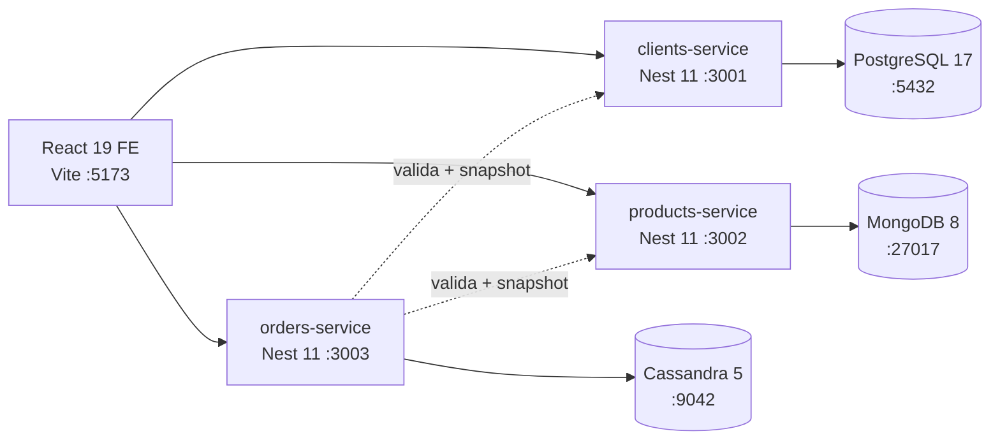
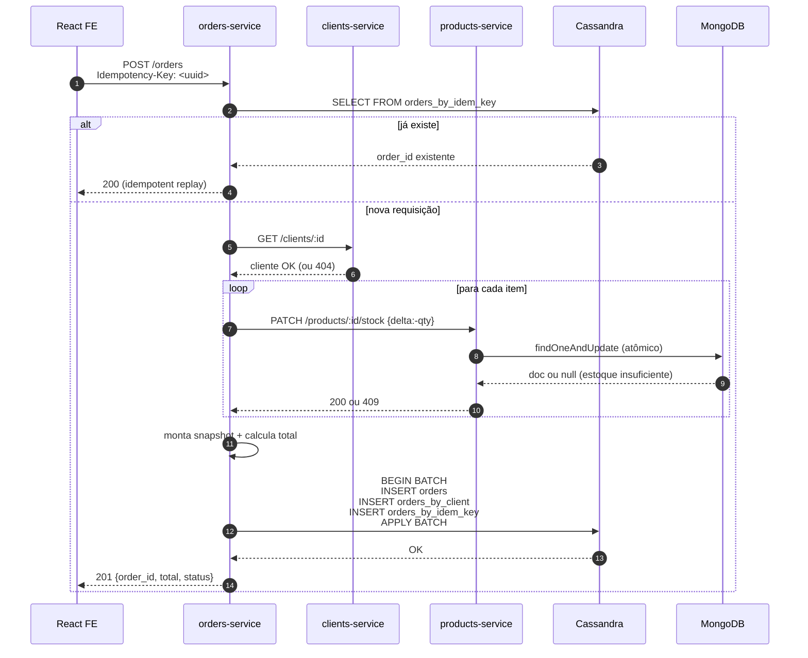

# Marketplace Polyglot — Projeto de Persistência Poliglota

[](.github/workflows/ci.yml)
[](LICENSE)
[](https://nodejs.org/)
[](https://docs.docker.com/compose/)
[](https://nestjs.com/)
[](https://www.postgresql.org/)
[](https://www.mongodb.com/)
[](https://cassandra.apache.org/)

> Aplicação acadêmica que materializa o conceito de **Polyglot Persistence**
> (Sadalage & Fowler, 2012): cada agregado é persistido no banco cujo modelo se
> alinha ao **padrão de acesso da aplicação**.

---

## Índice

1. [Tema escolhido](#1-tema-escolhido)
2. [Fundamentação teórica](#2-fundamentação-teórica)
3. [Justificativa de cada banco](#3-justificativa-de-cada-banco)
4. [Decisões negativas — por que NÃO outras combinações](#4-decisões-negativas--por-que-não-outras-combinações)
5. [Queries que provam cada escolha](#5-queries-que-provam-cada-escolha)
6. [Arquitetura](#6-arquitetura)
7. [Fluxo de criação de pedido](#7-fluxo-de-criação-de-pedido)
8. [Modelagem dos 3 bancos](#8-modelagem-dos-3-bancos)
9. [Como executar — do zero](#9-como-executar--do-zero)
10. [Endpoints e Swagger](#10-endpoints-e-swagger)
11. [Verificação end-to-end](#11-verificação-end-to-end)
12. [Decisões técnicas e trade-offs](#12-decisões-técnicas-e-trade-offs)
13. [Limitações e trabalhos futuros](#13-limitações-e-trabalhos-futuros)
14. [Estrutura do repositório](#14-estrutura-do-repositório)
15. [Versões testadas](#15-versões-testadas)
16. [Referências](#16-referências)

---

## 1. Tema escolhido

**Marketplace simplificado** com três agregados centrais — **clientes**, **produtos**
e **pedidos** — cada um com padrão de acesso distinto que justifica um banco
de modelo de dados diferente. O tema segue o exemplo do enunciado, escolhido
deliberadamente para **maximizar a clareza pedagógica**: o domínio é familiar e
permite focar na decisão arquitetural, não na complexidade do negócio.

---

## 2. Fundamentação teórica

A **persistência poliglota** é a tese de que aplicações modernas devem usar
**múltiplos sistemas de armazenamento**, escolhendo cada um pelo encaixe entre
modelo de dados e padrão de acesso, em vez de forçar todo dado num único banco
(Sadalage & Fowler, 2012). A escolha de cada banco neste projeto aplica três
eixos canônicos da literatura:

1. **Modelo de dados** — relacional, document ou wide-column (Sadalage & Fowler, 2012, cap. 2).
2. **CAP / PACELC** — trade-off entre consistência, disponibilidade e tolerância
   a particionamento; PACELC estende para considerar latência em modo normal
   (Brewer, 2000; Abadi, 2012).
3. **ACID × BASE** — garantias fortes versus eventual + tunable consistency.

### 2.1 Tabela comparativa

| Banco         | Modelo         | CAP (default)   | PACELC | Garantias                              | Caso forte                                      | Anti-caso                                  |
|---------------|----------------|-----------------|--------|----------------------------------------|--------------------------------------------------|--------------------------------------------|
| PostgreSQL 17 | Relacional     | CA (single)     | PC+EC  | ACID                                   | Integridade forte, JOINs, UNIQUE, FK              | Schema variável por categoria              |
| MongoDB 8     | Document       | CP (replica set)| PC+EC  | ACID por documento, BASE multi-doc     | Schema flexível, fetch de documento inteiro       | Unicidade cross-doc, integridade referencial |
| Cassandra 5   | Wide-column    | AP              | PA+EL  | BASE, tunable consistency (`ONE`/`QUORUM`/`ALL`) | Escrita massiva, time-series particionado | Queries ad-hoc, UNIQUE, JOIN              |

---

## 3. Justificativa de cada banco

### 3.1 Clientes → PostgreSQL

| Critério | Justificativa |
|----------|---------------|
| Modelo   | Atributos **tabulares estáveis** (nome, email, cpf, telefone, endereço). Não há variação por subtipo. |
| Acesso   | Lookup por **chave natural** (`email`/`cpf`), listagem paginada — sweet-spot de B-tree em RDB. |
| Integridade | **UNIQUE garantido pelo banco** em `email` e `cpf` (impossível bypass por race). |
| Referência | `id` estável e referenciado por pedidos — base do modelo de identidade. |
| Ecossistema | Driver maduro (`pg`), ORM declarativo (Prisma), tipos avançados (`uuid`, `jsonb`, `timestamptz`). |

### 3.2 Produtos → MongoDB

| Critério | Justificativa |
|----------|---------------|
| Modelo   | Atributos **heterogêneos por categoria** — um livro tem `autor`/`isbn`, uma camiseta tem `tamanho`/`cor`. Encaixa nativamente em document store via campo `attributes` aberto. |
| Acesso   | Leitura predominante é **"fetch documento inteiro por id"** (página de detalhe) — uma única operação, sem JOIN. |
| Estoque  | Update atômico de estoque via `findOneAndUpdate({stock:{$gte:qty}}, {$inc:{stock:-qty}})` — **operação atômica de documento único**, sem race condition. |
| Filtros  | Índices compostos cobrem `category + price` e `name` (text index). |

### 3.3 Pedidos → Cassandra

| Critério | Justificativa |
|----------|---------------|
| Modelo   | Linha endereçada por `partition key`; clustering temporal nativo. **Caso de livro-texto de wide-column**. |
| Acesso   | Query-rainha: "histórico de pedidos do cliente X ordenado do mais recente". Encaixa em `PRIMARY KEY ((client_id), order_id DESC)` com `TIMEUUID`. |
| Escrita  | Append-only; **latência de escrita baixa e previsível** (não trava o checkout). |
| Imutabilidade | Pedido é imutável após criação (modelo de domínio) — alinha com filosofia LSM-tree do Cassandra. |
| Atomicidade | **LOGGED BATCH** garante atomicidade entre as duas tabelas denormalizadas (`orders` + `orders_by_client`). |

---

## 4. Decisões negativas — por que **NÃO** outras combinações

A persistência poliglota exige **escolha informada**. Abaixo, por que cada
permutação alternativa foi rejeitada.

- **Produtos em PostgreSQL?** Atributos variáveis viriam como `jsonb` ou EAV.
  Índices GIN em `jsonb` funcionam, mas o ferramental de query/projeção do
  document store é mais natural para um catálogo heterogêneo. Adotar Postgres
  para tudo invalidaria o exercício de polyglot.

- **Pedidos em MongoDB?** Mongo escalaria, mas particionamento por `client_id`
  com clustering temporal é **nativo em Cassandra** e é o caso de livro-texto
  de wide-column. Em Mongo, o mesmo padrão exigiria configurar shard key
  manualmente.

- **Clientes em MongoDB?** UNIQUE em Mongo exige índice único + lógica de
  retry no app para race conditions. Em Postgres a unicidade é **garantida
  atomicamente pelo banco** — Mongo perde o casamento natural.

- **Clientes em Cassandra?** Cassandra penaliza queries ad-hoc, **não tem
  UNIQUE real** (LWT com `IF NOT EXISTS` mata performance), e não tem JOIN.
  Inadequado para entidade de identidade.

- **Produtos em Cassandra?** Filtros por categoria + faixa de preço exigiriam
  uma tabela denormalizada por combinação de filtro. Inviável para um catálogo
  que admite vários filtros simultâneos.

---

## 5. Queries que provam cada escolha

```sql
-- PostgreSQL: chave natural com UNIQUE garantido pelo banco
SELECT id FROM clients WHERE email = ?;
-- e cadastro com unicidade atômica:
INSERT INTO clients (...) VALUES (...);
-- → ERROR: duplicate key value violates unique constraint "clients_email_key"
```

```javascript
// MongoDB: schema variável + filtro composto + atomic stock update
db.products.findOneAndUpdate(
  { id: productId, stock: { $gte: qty } },
  { $inc: { stock: -qty } },
  { returnDocument: 'after' }
);
// Retorna null se estoque insuficiente — sem race condition
```

```cql
-- Cassandra: lê UMA partição, ordenação cronológica nativa via TIMEUUID
SELECT order_id, total, items_summary
FROM marketplace.orders_by_client
WHERE client_id = ?
ORDER BY order_id DESC
LIMIT 20;
```

---

## 6. Arquitetura



- **3 microserviços NestJS** independentes, um por agregado.
- **Comunicação inter-serviço:** REST síncrono via axios; propagação de
  `x-correlation-id` para rastreabilidade.
- **Sem API Gateway:** o FE chama os 3 serviços diretamente (CORS habilitado).
  Decisão deliberada — gateway seria over-engineering para o escopo acadêmico.
- **`orders-service` valida cliente e produto** via HTTP e **copia snapshot**
  (`name`, `email`, `unit_price`) no momento da escrita do pedido. O pedido
  fica auto-contido — leitura do histórico não precisa de fan-out cross-service.

---

## 7. Fluxo de criação de pedido



**Garantias do fluxo:**
- **Idempotência** — `Idempotency-Key` consultado antes do BATCH (evita pedido duplicado).
- **Atomicidade da escrita dupla** — `LOGGED BATCH` no Cassandra garante que
  `orders` e `orders_by_client` sejam consistentes entre si.
- **Sem race condition no estoque** — `findOneAndUpdate` com filtro `stock>=qty`
  é uma única operação atômica em Mongo.
- **Snapshot histórico** — `client_name`, `product_name`, `unit_price` são
  copiados no momento do pedido (correto contabilmente — se o cliente mudar o
  nome depois, a nota fiscal original não muda).

---

## 8. Modelagem dos 3 bancos

> Modelagem completa e justificada em [`docs/data-model.md`](docs/data-model.md).

### 8.1 PostgreSQL — `clients`

```sql
CREATE EXTENSION IF NOT EXISTS pgcrypto;
CREATE TABLE clients (
  id          UUID         PRIMARY KEY DEFAULT gen_random_uuid(),
  name        VARCHAR(120) NOT NULL,
  email       VARCHAR(160) NOT NULL UNIQUE,
  cpf         CHAR(11)     NOT NULL UNIQUE,
  phone       VARCHAR(20),
  address     JSONB        NOT NULL,
  created_at  TIMESTAMPTZ  NOT NULL DEFAULT now(),
  updated_at  TIMESTAMPTZ  NOT NULL DEFAULT now(),
  CHECK (address ? 'city' AND address ? 'state' AND address ? 'zip')
);
CREATE INDEX clients_name_idx ON clients (lower(name));
```

### 8.2 MongoDB — `marketplace.products`

```javascript
{
  _id: ObjectId,
  id: "<uuid v4>",              // ID externo cross-banco
  name, description, category,
  price: Decimal128,
  stock: Int,
  attributes: { /* aberto, varia por categoria */ },
  images: [String],
  created_at, updated_at
}
// Índices:
db.products.createIndex({ category: 1, price: 1 });
db.products.createIndex({ name: "text" });
db.products.createIndex({ id: 1 }, { unique: true });
```

### 8.3 Cassandra — query-first design

Duas tabelas denormalizadas + tabela de idempotência. Schema completo em
`infra/cassandra/init.cql`. Pontos-chave:

- **UDTs** (`client_snapshot`, `order_item`) preservam tipagem (`DECIMAL`).
- **`order_id` é `TIMEUUID`** — carrega o tempo nativamente, sem tie-break em
  timestamps iguais.
- **`TimeWindowCompactionStrategy`** com janela de 30 dias — padrão
  industrial para tabelas append-only time-series.
- **`LOGGED BATCH`** garante atomicidade entre `orders` e `orders_by_client`.

---

## 9. Como executar — do zero

### Pré-requisitos

- **Docker Desktop ≥ 4.20** (requer Docker Compose v2.20+ para
  `service_completed_successfully`)
- **4 GB de RAM livres** (Cassandra é o gargalo; 8 GB recomendado)
- **Portas livres:** 3001, 3002, 3003, 5173, 5432, 9042, 27017

### Comandos

```bash
git clone <repo-url>
cd PROJETO-TUNNING-DE-DADOS
cp .env.example .env                  # ajustar se necessário
docker compose up --build
# Aguardar ~2 minutos no primeiro boot (Cassandra leva ~90s para ficar healthy)
```

Quando todos os healthchecks passarem:
- **Frontend:** http://localhost:5173
- **Swagger clients-service:** http://localhost:3001/docs
- **Swagger products-service:** http://localhost:3002/docs
- **Swagger orders-service:** http://localhost:3003/docs

### Atalhos via npm

```bash
npm run up           # docker compose up --build
npm run logs         # docker compose logs -f
npm run down         # docker compose down
npm run down:clean   # docker compose down -v  (apaga volumes)
npm run psql         # abre psql no Postgres
npm run mongosh      # abre mongosh
npm run cqlsh        # abre cqlsh
```

### Modo fallback (máquina sem 4 GB para Cassandra)

Use **DataStax Astra DB free tier** ou rode Cassandra fora do compose com
`JVM_OPTS="-Xms512m -Xmx512m"`. Ajuste `CASSANDRA_CONTACT_POINTS` no `.env`.

---

## 10. Endpoints e Swagger

Cada serviço expõe Swagger UI em `/docs`. Resumo:

### clients-service `:3001`
| Método | Rota             |
|--------|------------------|
| POST   | `/clients`       |
| GET    | `/clients`       |
| GET    | `/clients/:id`   |
| PUT    | `/clients/:id`   |
| DELETE | `/clients/:id`   |
| GET    | `/health`        |

### products-service `:3002`
| Método | Rota                    |
|--------|-------------------------|
| POST   | `/products`             |
| GET    | `/products`             |
| GET    | `/products/:id`         |
| PUT    | `/products/:id`         |
| PATCH  | `/products/:id/stock`   |
| DELETE | `/products/:id`         |
| GET    | `/health`               |

### orders-service `:3003`
| Método | Rota                              |
|--------|-----------------------------------|
| POST   | `/orders` (header `Idempotency-Key`) |
| GET    | `/orders/:id`                     |
| GET    | `/orders/by-client/:client_id`    |
| PATCH  | `/orders/:id/status`              |
| GET    | `/health`                         |
| GET    | `/health/deep`                    |

> Coleção Postman pronta em [`docs/marketplace.postman_collection.json`](docs/marketplace.postman_collection.json).

---

## 11. Verificação end-to-end

Roteiro executável para o avaliador validar que **os 3 bancos estão sendo usados**:

```bash
# 1) Health dos 3 serviços
curl http://localhost:3001/health
curl http://localhost:3002/health
curl http://localhost:3003/health/deep

# 2) Postgres com dado (seed)
docker compose exec postgres psql -U postgres -d marketplace \
  -c "SELECT id, email FROM clients;"

# 3) Mongo com dado (seed)
docker compose exec mongo mongosh marketplace \
  --eval "db.products.find({}, {name:1, category:1, price:1}).pretty()"

# 4) Criar pedido via API (com idempotência)
curl -X POST http://localhost:3003/orders \
  -H 'Content-Type: application/json' \
  -H 'Idempotency-Key: 11111111-1111-1111-1111-111111111111' \
  -d '{"client_id":"<id-do-passo-2>","items":[{"product_id":"<id-do-passo-3>","quantity":2}]}'

# 5) Repetir o mesmo POST → retorna o mesmo order_id (prova idempotência)
curl -X POST http://localhost:3003/orders \
  -H 'Content-Type: application/json' \
  -H 'Idempotency-Key: 11111111-1111-1111-1111-111111111111' \
  -d '{"client_id":"<id-do-passo-2>","items":[{"product_id":"<id-do-passo-3>","quantity":2}]}'

# 6) Cassandra com o pedido nas DUAS tabelas (prova LOGGED BATCH)
docker compose exec cassandra cqlsh -e \
  "SELECT order_id, client_id, total FROM marketplace.orders;"
docker compose exec cassandra cqlsh -e \
  "SELECT client_id, order_id, total FROM marketplace.orders_by_client;"

# 7) Histórico do cliente (a query estrela do Cassandra)
curl "http://localhost:3003/orders/by-client/<client_id>?limit=20"

# 8) FE end-to-end
# http://localhost:5173 → /clients → /products → /checkout → /clients/:id/orders
```

---

## 12. Decisões técnicas e trade-offs

| Decisão | Trade-off | Motivo |
|---------|-----------|--------|
| 3 microserviços (vs monolito modular) | Mais infra para subir | Alinha com o exemplo do enunciado e isola dependências de banco |
| REST síncrono (vs messaging) | Acoplamento temporal | Simplicidade acadêmica; demo fica linear e auditável |
| Sem API Gateway | FE precisa conhecer 3 URLs | Reduz peças móveis; CORS resolve trivialmente |
| Snapshot no pedido | Dados "envelhecem" se cliente mudar nome | **Correto contabilmente** — nota fiscal histórica preserva estado |
| LOGGED BATCH no Cassandra | Custo de performance vs UNLOGGED | Garantia de atomicidade entre `orders` e `orders_by_client` justifica |
| TIMEUUID em vez de UUID | Ligeiramente maior | Ordenação cronológica nativa sem tie-break |
| Prisma (vs TypeORM) | Step extra `prisma generate` | Schema declarativo, migrations versionadas, melhor para defender em aula |
| Mongoose (vs driver raw) | Camada extra | Schema documentado mesmo em document store — disciplina pedagógica |
| Cassandra-driver raw (sem ORM) | Mais SQL/CQL manual | Não há ORM Cassandra maduro em Node — driver oficial DataStax é a opção sã |

---

## 13. Limitações e trabalhos futuros

**Limitações conhecidas (documentadas):**
- **Saga simples** — se o `LOGGED BATCH` no Cassandra falhar depois do estoque
  já ter sido decrementado no Mongo, há inconsistência. Mitigação seria
  rollback compensatório (out of scope acadêmico).
- **Sem autenticação** — fora do escopo do enunciado, que pede CRUD aberto.
- **Sem paginação cursor-based** no listing de produtos (skip/limit suficiente).
- **`cassandra-init` é container separado**, não roda como `init container` —
  Compose v2.20+ trata isso via `service_completed_successfully`.

**Trabalhos futuros:**
- Substituir REST síncrono por eventos (RabbitMQ/Kafka) para desacoplamento.
- Adicionar cache (Redis) na frente do products-service.
- Observabilidade (Prometheus + Grafana).
- Saga pattern formalizado para o fluxo de pedido.

---

## 14. Estrutura do repositório

```
PROJETO-TUNNING-DE-DADOS/
├── README.md                              # este arquivo
├── docker-compose.yml
├── package.json                           # npm workspaces + scripts
├── .env.example
├── projeto.md                             # enunciado original
├── CHANGELOG.md  LICENSE  .gitignore  .editorconfig  .prettierrc
├── docs/
│   ├── data-model.md                      # modelagem detalhada e justificada
│   ├── stack-rationale.md                 # Prisma/Mongoose/cassandra-driver
│   └── marketplace.postman_collection.json
├── services/
│   ├── clients-service/                   # NestJS + Prisma + Postgres
│   ├── products-service/                  # NestJS + Mongoose + Mongo
│   └── orders-service/                    # NestJS + cassandra-driver + Cassandra
├── frontend/                              # Vite + React 19 + TS + Tailwind
└── infra/
    ├── postgres/init.sql
    ├── mongo/init.js
    └── cassandra/init.cql
```

---

## 15. Versões testadas

| Componente | Versão |
|------------|--------|
| Node.js    | 22 LTS |
| NestJS     | 11.x   |
| React      | 19.x   |
| Vite       | 5.x    |
| PostgreSQL | 17     |
| MongoDB    | 8      |
| Cassandra  | 5.0    |
| Docker Engine | 25+ |
| Docker Compose | 2.20+ |

---

## 16. Referências

### Bibliografia primária

- **SADALAGE, P. J.; FOWLER, M.** *NoSQL Distilled: A Brief Guide to the
  Emerging World of Polyglot Persistence*. Boston: Addison-Wesley, 2012.
- **BREWER, E.** *Towards Robust Distributed Systems*. In: Proceedings of the
  19th Annual ACM Symposium on Principles of Distributed Computing (PODC),
  Portland, 2000.
- **ABADI, D.** *Consistency Tradeoffs in Modern Distributed Database System
  Design: CAP is Only Part of the Story*. IEEE Computer, v. 45, n. 2, p. 37-42,
  2012.
- **CHEBOTKO, A.; KASHLEV, A.; LU, S.** *A Big Data Modeling Methodology for
  Apache Cassandra*. IEEE International Congress on Big Data, 2015.

### Documentação oficial

- [PostgreSQL 17 Documentation](https://www.postgresql.org/docs/17/)
- [MongoDB 8 Manual](https://www.mongodb.com/docs/manual/)
- [Apache Cassandra 5.0 Documentation](https://cassandra.apache.org/doc/5.0/)
- [NestJS Documentation](https://docs.nestjs.com/)
- [DataStax Node.js Driver for Apache Cassandra](https://docs.datastax.com/en/developer/nodejs-driver/)

---

_Projeto desenvolvido para a disciplina de Persistência Poliglota._
