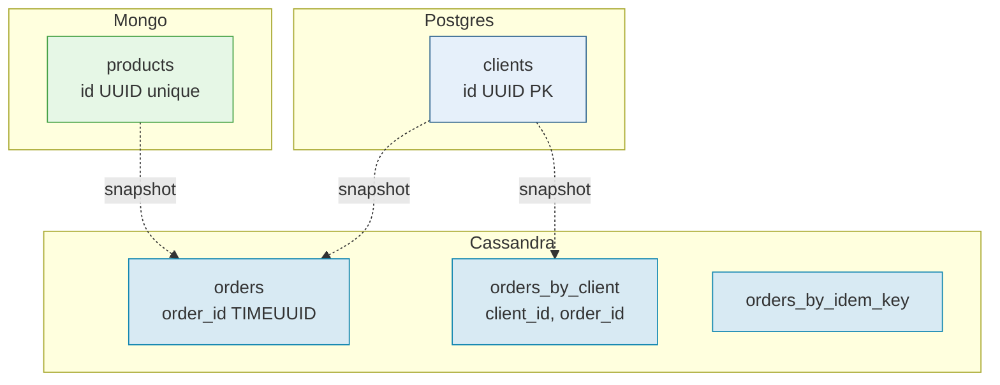

# Modelagem dos 3 bancos — decisões justificadas

Este documento aprofunda a modelagem apresentada no README, registrando o
**porquê** de cada decisão de schema e indexação.

---

## 1. PostgreSQL — `clients`

### Schema

```sql
CREATE EXTENSION IF NOT EXISTS pgcrypto;

CREATE TABLE clients (
  id          UUID         PRIMARY KEY DEFAULT gen_random_uuid(),
  name        VARCHAR(120) NOT NULL,
  email       VARCHAR(160) NOT NULL UNIQUE,
  cpf         CHAR(11)     NOT NULL UNIQUE,
  phone       VARCHAR(20),
  address     JSONB        NOT NULL,
  created_at  TIMESTAMPTZ  NOT NULL DEFAULT now(),
  updated_at  TIMESTAMPTZ  NOT NULL DEFAULT now(),
  CHECK (address ? 'city' AND address ? 'state' AND address ? 'zip')
);

CREATE INDEX clients_name_idx ON clients (lower(name));
```

### Decisões e justificativas

| Decisão | Justificativa |
|---------|---------------|
| `id UUID` (não `BIGSERIAL`) | Identificador cross-banco — o mesmo `client_id` aparece em pedidos no Cassandra. UUID v4 é livre de coordenação. |
| `gen_random_uuid()` (`pgcrypto`) | Geração no banco evita ida do app, garante ID antes do INSERT lógico. |
| `email`/`cpf` com `UNIQUE` | **Unicidade garantida pelo banco** — race-condition-proof. Em Mongo/Cassandra essa garantia exigiria lógica extra. |
| `cpf CHAR(11)` | CPF tem comprimento fixo; `CHAR` é mais eficiente que `VARCHAR` aqui. |
| `address JSONB` (não `TEXT` nem tabela separada) | Endereço é semi-estruturado e raramente consultado em isolamento. JSONB preserva flexibilidade sem normalização excessiva. |
| `CHECK (address ? 'city' AND ...)` | **Validação de schema em camada de banco** mesmo sendo JSONB — disciplina mínima. |
| `created_at`/`updated_at TIMESTAMPTZ` | `TZ` previne armadilhas de fuso. |
| Índice `lower(name)` | Suporta busca case-insensitive em listagem (`WHERE lower(name) LIKE 'jo%'`). |

### Queries-alvo

```sql
-- Identificação por chave natural (login, validação cross-service)
SELECT id, name FROM clients WHERE email = $1;

-- Listagem paginada
SELECT * FROM clients ORDER BY created_at DESC OFFSET $1 LIMIT $2;

-- Busca por nome
SELECT * FROM clients WHERE lower(name) LIKE $1 ORDER BY created_at DESC LIMIT 50;
```

---

## 2. MongoDB — `marketplace.products`

### Schema (Mongoose)

```javascript
const ProductSchema = new Schema({
  id:          { type: String, required: true, unique: true },   // UUID v4 externo
  name:        { type: String, required: true },
  description: String,
  category:    { type: String, required: true, index: true },
  price:       { type: Schema.Types.Decimal128, required: true },
  stock:       { type: Number, required: true, default: 0, min: 0 },
  attributes:  { type: Schema.Types.Mixed, default: {} },         // schema aberto
  images:      [String],
}, {
  timestamps: { createdAt: 'created_at', updatedAt: 'updated_at' },
  collection: 'products',
});

ProductSchema.index({ category: 1, price: 1 });
ProductSchema.index({ name: 'text' });
```

### Decisões e justificativas

| Decisão | Justificativa |
|---------|---------------|
| Campo `id` (string UUID) separado de `_id` (ObjectId) | Identificador **cross-banco** uniformizado em UUID v4. `_id` interno fica como ObjectId para eficiência do Mongo. |
| `price: Decimal128` | Evita erros de ponto flutuante em moeda — equivale a `DECIMAL` do Postgres. |
| `attributes: Mixed` | Campo deliberadamente aberto — **é o ponto que justifica o uso de document store**. Livro: `{autor, isbn}`; camiseta: `{tamanho, cor}`. |
| `stock: { min: 0 }` | Validação Mongoose; o `findOneAndUpdate` atômico é a defesa real. |
| Índice composto `{category, price}` | Cobre o filtro mais comum (lista de produtos de uma categoria por faixa de preço). |
| Índice `{name: 'text'}` | Busca por palavra-chave. |
| Índice único `{id: 1}` | Garante unicidade do UUID cross-banco. |

### Operação atômica de estoque

```javascript
const result = await Product.findOneAndUpdate(
  { id: productId, stock: { $gte: qty } },
  { $inc: { stock: -qty } },
  { new: true }
);
if (!result) throw new InsufficientStockError(productId);
```

**Por que isso resolve a race condition:** o filtro `stock: { $gte: qty }` e o
`$inc` acontecem na **mesma operação atômica do MongoDB**. Se dois clientes
tentam comprar o último item ao mesmo tempo, apenas um vê `result != null`.
Sem essa operação, seria necessário `findOne` + check + `update` — três
operações com janela de race entre elas.

### Queries-alvo

```javascript
// Página de detalhe (operação típica do document store)
db.products.findOne({ id: productId });

// Filtro de catálogo
db.products.find({ category: "vestuario", price: { $gte: 50, $lte: 200 } })
  .sort({ price: 1 });

// Busca por nome
db.products.find({ $text: { $search: "camiseta" } });
```

---

## 3. Cassandra — query-first design

### Princípio orientador

Em Cassandra **não se faz JOIN** nem `WHERE` em colunas arbitrárias. A linha é
endereçada por **partition key**. Modelagem é dirigida pelas queries
(Chebotko et al., 2015):

> "Design tables around queries, not entities."

### Queries que a aplicação precisa servir

| ID | Query | Tabela |
|----|-------|--------|
| Q1 | Detalhe de um pedido por `order_id` | `orders` |
| Q2 | Histórico de pedidos de um cliente, ordenado cronologicamente DESC | `orders_by_client` |
| Q3 | Consulta de idempotência por chave | `orders_by_idem_key` |

### Schema

```cql
CREATE KEYSPACE marketplace
  WITH replication = {'class':'SimpleStrategy','replication_factor':1};
-- ⚠️ single-node dev only; produção usaria NetworkTopologyStrategy RF=3.

-- ----- User-Defined Types -----
CREATE TYPE marketplace.client_snapshot (
  client_id UUID,
  name      TEXT,
  email     TEXT
);

CREATE TYPE marketplace.order_item (
  product_id  UUID,
  name        TEXT,
  unit_price  DECIMAL,
  quantity    INT
);

-- ----- Q1: detalhe por order_id -----
CREATE TABLE marketplace.orders (
  order_id        TIMEUUID PRIMARY KEY,
  client_id       UUID,
  status          TEXT,
  total           DECIMAL,
  client_snapshot FROZEN<client_snapshot>,
  items           LIST<FROZEN<order_item>>
) WITH compaction = {
  'class'                : 'TimeWindowCompactionStrategy',
  'compaction_window_unit': 'DAYS',
  'compaction_window_size': 30
};

-- ----- Q2: histórico do cliente -----
CREATE TABLE marketplace.orders_by_client (
  client_id     UUID,
  order_id      TIMEUUID,
  status        TEXT,
  total         DECIMAL,
  items_summary TEXT,
  PRIMARY KEY ((client_id), order_id)
) WITH CLUSTERING ORDER BY (order_id DESC)
  AND compaction = {
  'class'                : 'TimeWindowCompactionStrategy',
  'compaction_window_unit': 'DAYS',
  'compaction_window_size': 30
};

-- ----- Q3: idempotência -----
CREATE TABLE marketplace.orders_by_idem_key (
  idem_key   TEXT PRIMARY KEY,
  order_id   TIMEUUID,
  created_at TIMESTAMP
);
```

### Decisões e justificativas

| Decisão | Justificativa |
|---------|---------------|
| **UDTs** (`client_snapshot`, `order_item`) | Preserva **tipagem nativa** (`DECIMAL` para preço, `INT` para quantidade). Alternativa `MAP<TEXT,TEXT>` perderia tudo isso e seria anti-idiomática. |
| **`order_id TIMEUUID`** (não `UUID`) | TIMEUUID carrega timestamp no próprio identificador. Ordenação cronológica é **nativa**, sem coluna `order_date` extra. Resolve tie-break em criações simultâneas. |
| **PK `((client_id), order_id)`** em `orders_by_client` | Particionamento por cliente garante que o histórico de um cliente seja lido em **uma única partição** — caso ideal do Cassandra. |
| **`CLUSTERING ORDER BY (order_id DESC)`** | Ordenação cronológica decrescente armazenada **fisicamente** — pagina histórico é leitura sequencial em disco. |
| **TWCS (TimeWindowCompactionStrategy)** com janela de 30 dias | Padrão industrial para dados time-series imutáveis. Cada janela vira um SSTable separado — compaction barata, eviction trivial se houver TTL. STCS default seria ruim aqui. |
| **Duas tabelas para a mesma entidade** (`orders` + `orders_by_client`) | Denormalização intencional — Cassandra **não tem JOIN**, então cada query precisa de tabela própria. Aceitamos escrita dupla. |
| **`LOGGED BATCH`** na escrita do pedido | Garante atomicidade entre as duas inserções (mesmo em partições diferentes). UNLOGGED seria mais rápido mas perderia a garantia. |
| **`orders_by_idem_key`** | Tabela auxiliar para idempotência — consultada **antes** do BATCH. Resolve double-submit do FE. |

### O BATCH na prática

```cql
BEGIN BATCH
  INSERT INTO marketplace.orders (
    order_id, client_id, status, total, client_snapshot, items
  ) VALUES (?, ?, 'pending', ?, ?, ?);

  INSERT INTO marketplace.orders_by_client (
    client_id, order_id, status, total, items_summary
  ) VALUES (?, ?, 'pending', ?, ?);

  INSERT INTO marketplace.orders_by_idem_key (
    idem_key, order_id, created_at
  ) VALUES (?, ?, toTimestamp(now()));
APPLY BATCH;
```

**O que LOGGED BATCH garante:** Cassandra escreve um *batchlog* replicado antes
de aplicar as inserções. Se o coordenador morrer no meio, o batchlog é
re-aplicado por outro nó — todas as inserções acontecem, ou nenhuma. **Não é
transação ACID**, mas é o mais próximo que Cassandra oferece e é suficiente
para o cenário aqui.

### Queries-alvo

```cql
-- Q1: detalhe (lê 1 partição)
SELECT * FROM marketplace.orders WHERE order_id = ?;

-- Q2: histórico do cliente (a query estrela — lê 1 partição, ordenada fisicamente)
SELECT order_id, status, total, items_summary
FROM marketplace.orders_by_client
WHERE client_id = ?
ORDER BY order_id DESC
LIMIT 20;

-- Q3: idempotência
SELECT order_id FROM marketplace.orders_by_idem_key WHERE idem_key = ?;
```

---

## 4. Como os 3 modelos conversam



- Não há FK física entre bancos.
- `client_id` (UUID) é a **chave logical** que conecta Postgres e Cassandra.
- `product_id` (UUID) conecta Mongo e Cassandra.
- O snapshot é uma cópia **deliberada** no momento do pedido — não há
  consulta cross-banco em runtime para montar o histórico.

---

## 5. Referências

- SADALAGE, P. J.; FOWLER, M. *NoSQL Distilled*, cap. 4-6, 2012.
- CHEBOTKO, A.; KASHLEV, A.; LU, S. *A Big Data Modeling Methodology for
  Apache Cassandra*. IEEE BigData Congress, 2015.
- Documentação Cassandra: [Data Modeling](https://cassandra.apache.org/doc/5.0/cassandra/data_modeling/index.html).
- Documentação MongoDB: [Atomicity and Transactions](https://www.mongodb.com/docs/manual/core/write-operations-atomicity/).
- Documentação PostgreSQL: [JSONB Indexing](https://www.postgresql.org/docs/17/datatype-json.html).
