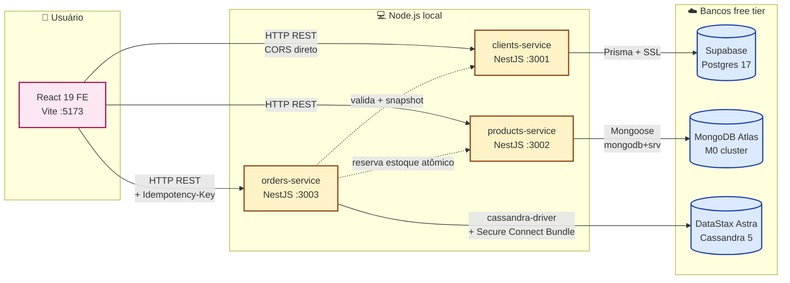
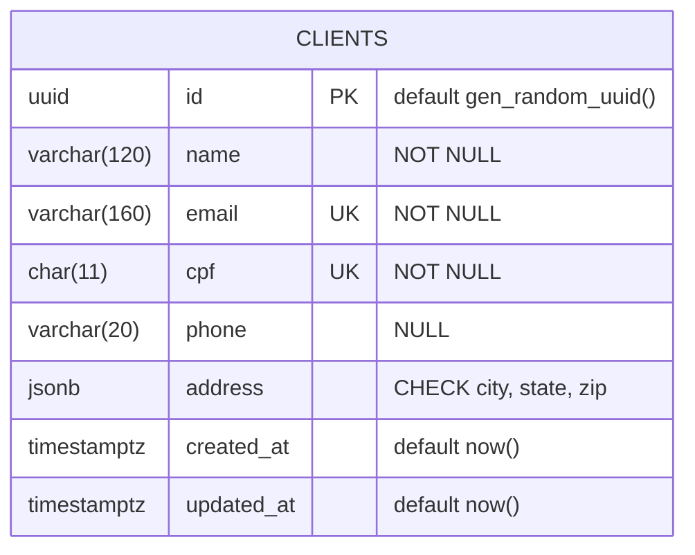
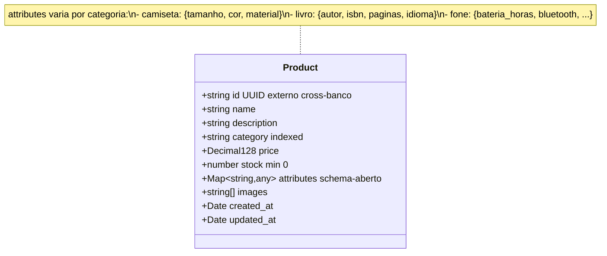
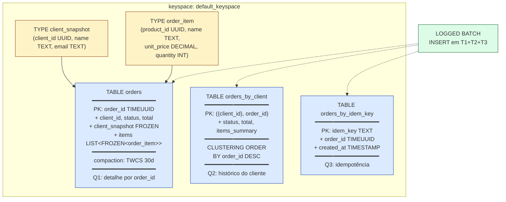
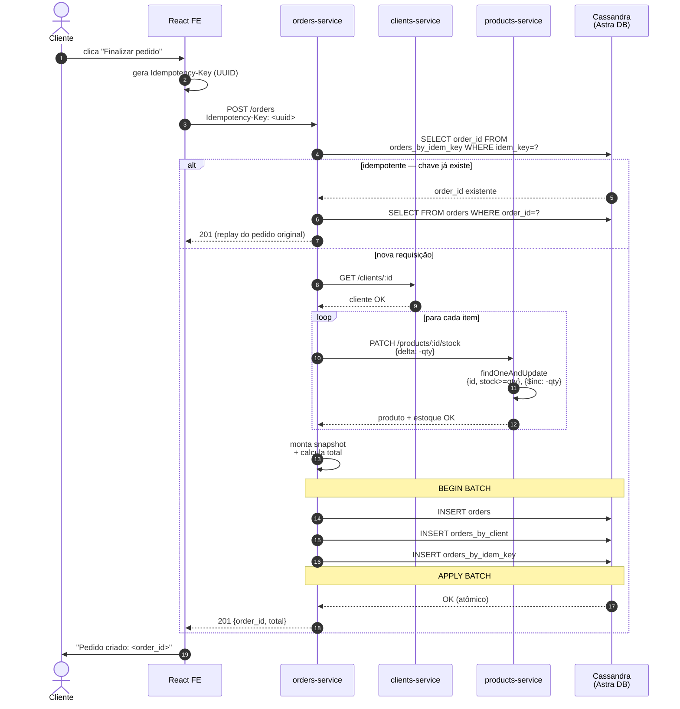
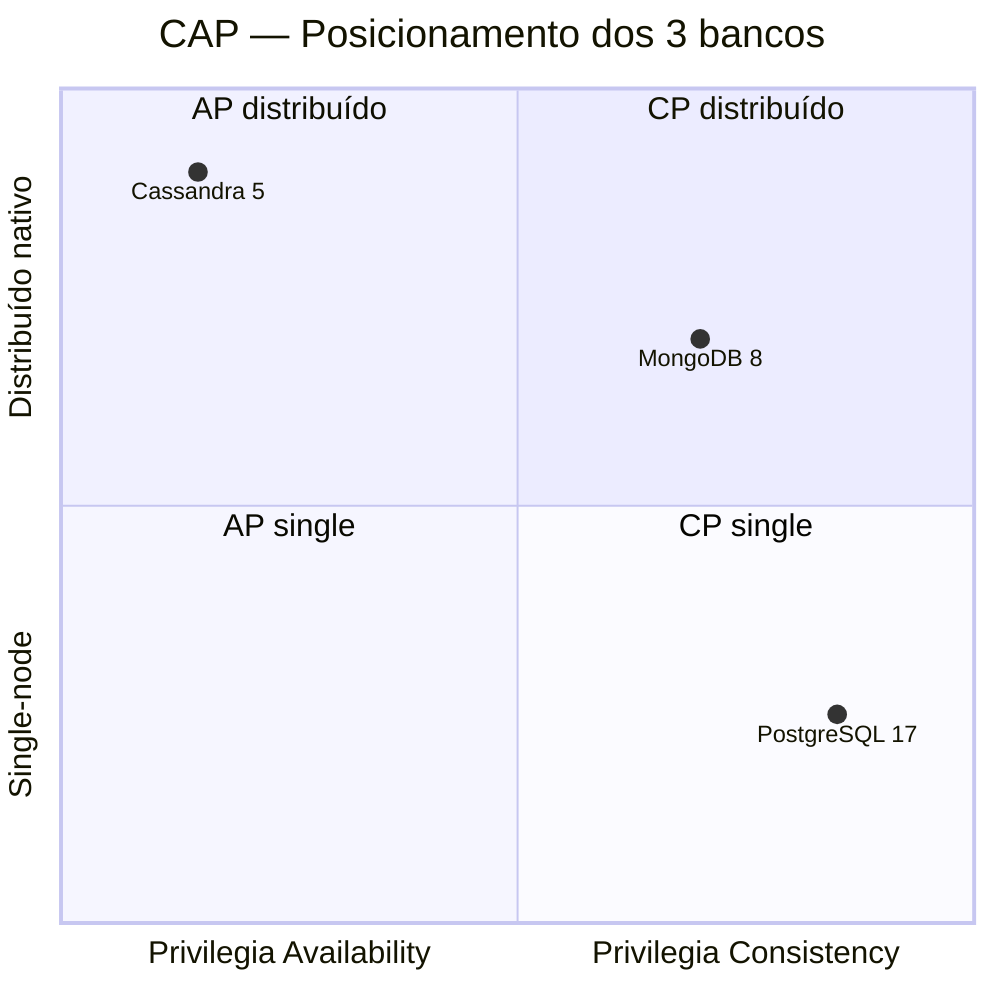
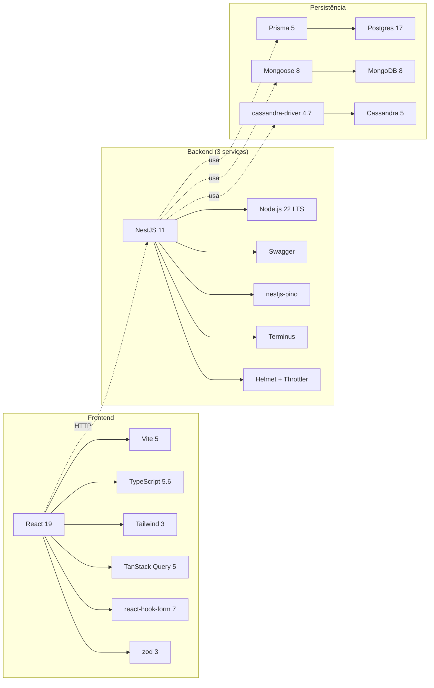

# Diagramas — Marketplace Polyglot

Todos os diagramas em Mermaid (renderizam nativamente no GitHub e no Marp).

---

## 1. Arquitetura — modo cloud (atual em produção)

---

## 2. ER do Postgres — `clients`

**Constraints declaradas no banco** (não no app):
- `UNIQUE(email)` e `UNIQUE(cpf)` — atomicidade garantida pelo Postgres
- `CHECK (address ? 'city' AND address ? 'state' AND address ? 'zip')` — disciplina mínima mesmo em JSONB
- Índice secundário: `clients_name_idx ON (lower(name))` — suporta busca case-insensitive

---

## 3. Modelo lógico — MongoDB `products`

**Índices:**
- `{ id: 1 }` unique — identificador cross-banco
- `{ category: 1, price: 1 }` composto — filtro de catálogo
- `{ name: 'text' }` — busca por palavra-chave

---

## 4. Cassandra — query-first design

**Decisões idiomáticas:**
1. **TIMEUUID** > UUID v4 — carrega timestamp, ordenação cronológica nativa
2. **UDTs** > MAP<TEXT,TEXT> — preserva tipos (`DECIMAL` para preço)
3. **TWCS** (TimeWindowCompactionStrategy) — padrão para append-only time-series
4. **3 tabelas para 1 entidade** — denormalização query-driven (Chebotko et al. 2015)
5. **LOGGED BATCH** > UNLOGGED — atomicidade entre partições via batchlog

---

## 5. Fluxo de criação de pedido (sequence)

**Garantias do fluxo:**
- **Idempotência** — `Idempotency-Key` evita pedido duplicado
- **Atomicidade BATCH** — `orders` e `orders_by_client` ficam consistentes
- **Sem race no estoque** — `findOneAndUpdate` é atômico no Mongo
- **Snapshot** — `client_name` e `unit_price` são copiados (correto contabilmente)

---

## 6. Posicionamento CAP/PACELC dos 3 bancos

| Banco        | CAP padrão  | PACELC | Trade-off escolhido                  |
|--------------|-------------|--------|--------------------------------------|
| Postgres     | CA (single) | PC+EC  | Consistência forte, latência baixa   |
| MongoDB      | CP (RS)     | PC+EC  | Consistência por documento + escalabilidade |
| Cassandra    | AP          | PA+EL  | Disponibilidade + escala horizontal  |

---

## 7. Stack tecnológica completa

