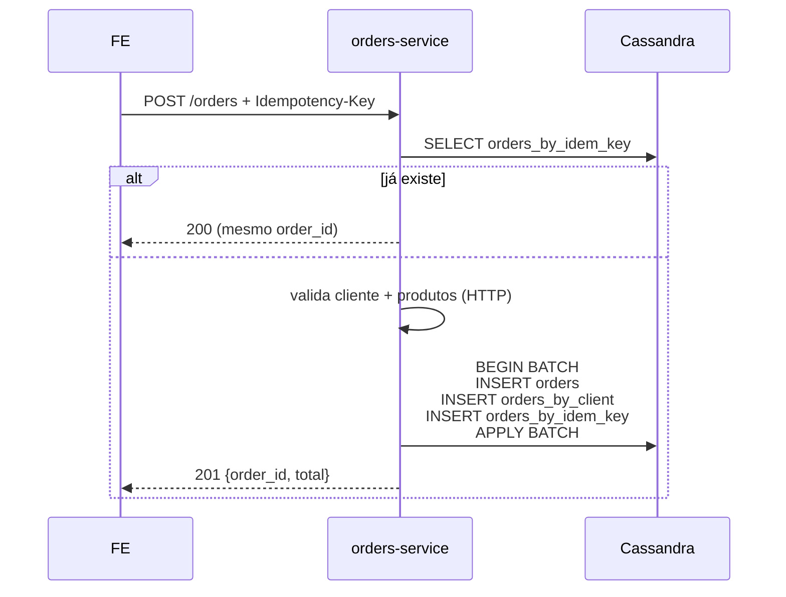

<!--
Slide deck — Marketplace Polyglot
Formato: Marp (https://marp.app/) — VS Code extension renderiza ao vivo.
Export: `npx @marp-team/marp-cli docs/slides.md -o docs/slides.pdf`
-->
---
marp: true
theme: default
paginate: true
backgroundColor: '#fff'
style: |
  section { font-family: 'Segoe UI', Roboto, sans-serif; padding: 60px; }
  h1 { color: #1e40af; border-bottom: 3px solid #1e40af; padding-bottom: 8px; }
  h2 { color: #1e3a8a; }
  table { font-size: 0.85em; }
  code { background: #f1f5f9; padding: 2px 6px; border-radius: 4px; }
  pre { font-size: 0.75em; background: #0f172a; color: #e2e8f0; padding: 16px; border-radius: 8px; }
  .small { font-size: 0.8em; color: #64748b; }
---

# Marketplace Polyglot
### Persistência Poliglota em Prática

**PostgreSQL + MongoDB + Cassandra**
em uma única aplicação distribuída

<br>

🔗 https://github.com/daviz1nn/marketplace-polyglot

<div class="small">
Disciplina de Bancos de Dados Não Relacionais — 2026/1
</div>

---

# 1. O problema

> Aplicações modernas têm **agregados de dados com padrões de acesso heterogêneos**.

Forçar tudo num único banco relacional gera:

- Schemas rígidos para entidades naturalmente heterogêneas (catálogo)
- Queries time-series ineficientes em B-tree
- Operações concorrentes que disputam o mesmo cluster

<br>

**Tese (Sadalage & Fowler, 2012):** cada agregado deve ser persistido no banco cujo **modelo** se alinha ao seu **padrão de acesso**.

---

# 2. Domínio — Marketplace

Três agregados, três padrões de acesso distintos:

| Entidade   | Padrão de acesso                            | Volume          |
|------------|---------------------------------------------|-----------------|
| Clientes   | lookup por chave natural (email/cpf), UNIQUE | baixo           |
| Produtos   | schema variável por categoria + filtros     | médio, leitura  |
| Pedidos    | escrita append-only + histórico por cliente | **alto write**  |

---

# 3. Tabela comparativa dos 3 bancos

| Banco          | Modelo       | CAP   | Garantias              | Caso forte               |
|----------------|--------------|-------|------------------------|--------------------------|
| PostgreSQL 17  | Relacional   | CA    | ACID                   | UNIQUE, JOIN, integridade |
| MongoDB 8      | Document     | CP    | ACID/doc, BASE multi   | Schema flexível          |
| Cassandra 5    | Wide-column  | AP    | BASE + tunable         | Escrita massiva, time-series |

<br>

<div class="small">
PACELC: Postgres = PC+EC, Mongo = PC+EC, Cassandra = PA+EL
</div>

---

# 4. Mapeamento — e por que NÃO o inverso

| ✅ Escolha | ❌ Alternativa rejeitada |
|-----------|-------------------------|
| Clientes → Postgres | Mongo: UNIQUE não atômico • Cassandra: sem UNIQUE real |
| Produtos → Mongo | Postgres: `jsonb` perde ferramental • Cassandra: filtros ad-hoc inviáveis |
| Pedidos → Cassandra | Mongo: shard manual • Postgres: não escala horizontal |

**A nota está aqui** — escolha **informada**, não default.

---

# 5. Modelagem — PostgreSQL `clients`

```sql
CREATE TABLE clients (
  id          UUID         PRIMARY KEY DEFAULT gen_random_uuid(),
  name        VARCHAR(120) NOT NULL,
  email       VARCHAR(160) NOT NULL UNIQUE,  -- atômico
  cpf         CHAR(11)     NOT NULL UNIQUE,
  phone       VARCHAR(20),
  address     JSONB        NOT NULL,
  CHECK (address ? 'city' AND address ? 'state' AND address ? 'zip')
);
```

**Por que aqui:** integridade forte garantida pelo **banco**, não pelo app.

---

# 6. Modelagem — MongoDB `products`

```javascript
{
  id: "uuid",
  name: "Camiseta Básica",
  category: "vestuario",
  price: Decimal128("49.90"),
  stock: 120,
  attributes: { tamanho: "M", cor: "azul" }     // varia!
}
// Outro produto, mesma coleção:
{
  ...
  category: "livros",
  attributes: { autor: "...", isbn: "...", paginas: 480 }
}
```

**Atualização atômica de estoque** sem race condition:
```javascript
findOneAndUpdate(
  { id, stock: { $gte: qty } },
  { $inc: { stock: -qty } }
);
```

---

# 7. Modelagem — Cassandra (query-first design)

```cql
CREATE TYPE order_item ( product_id UUID, name TEXT,
                         unit_price DECIMAL, quantity INT );

CREATE TABLE orders (
  order_id  TIMEUUID PRIMARY KEY,   -- carrega tempo nativamente
  client_id UUID, status TEXT, total DECIMAL,
  client_snapshot FROZEN<client_snapshot>,
  items LIST<FROZEN<order_item>>
);

CREATE TABLE orders_by_client (
  client_id UUID, order_id TIMEUUID, status TEXT, total DECIMAL,
  items_summary TEXT,
  PRIMARY KEY ((client_id), order_id)
) WITH CLUSTERING ORDER BY (order_id DESC);
```

**TWCS** (compaction) + **UDT** (tipagem preservada) + **denormalização intencional**.

---

# 8. Arquitetura — 3 microserviços

```
React 19 FE (Vite, :5173)
   ├──► clients-service  (Nest 11, :3001) ──► Postgres 17
   ├──► products-service (Nest 11, :3002) ──► MongoDB 8
   └──► orders-service   (Nest 11, :3003) ──► Cassandra 5
                                          │
                                          └─ valida + snapshot ─►
                                             clients-service +
                                             products-service
```

REST síncrono · CORS direto · sem API Gateway · correlation-id propagado.

---

# 9. Fluxo de pedido (LOGGED BATCH + Idempotência)



---

# 10. Decisões técnicas defensáveis

- **TIMEUUID** > UUID v4 → ordenação cronológica nativa
- **UDTs** > MAP<TEXT,TEXT> → tipagem preservada (DECIMAL para preço)
- **LOGGED BATCH** → atomicidade entre as 3 tabelas Cassandra
- **`findOneAndUpdate` atômico** → resolve race de estoque numa única operação
- **Idempotency-Key** → previne double-submit em retries de rede
- **Snapshot de cliente/produto** no pedido → histórico contábil correto
- **TimeWindowCompactionStrategy** (TWCS) → padrão para time-series

---

# 11. Modo cloud — execução real testada

| Banco          | Provedor               | Free tier         |
|----------------|------------------------|-------------------|
| Postgres       | **Supabase**           | 500 MB DB         |
| MongoDB        | **Atlas M0**           | 512 MB cluster    |
| Cassandra      | **DataStax Astra DB**  | 5 GB serverless   |

`npm run dev:local` sobe os 4 serviços Node localmente, conectando aos 3 bancos cloud.

**12/12 testes e2e passando** contra a stack cloud (`npm run e2e`).

---

# 12. Demo ao vivo

1. http://localhost:5173 → **Clientes** (lista do Postgres)
2. **Produtos** — filtra por categoria, vê `attributes` variando (Mongo)
3. **Checkout** — cria pedido → toca os 3 serviços
4. **Histórico** — query estrela do Cassandra
5. Astra UI → CQL Console:
   ```cql
   SELECT order_id, total, items_summary
   FROM default_keyspace.orders_by_client
   WHERE client_id = ?;
   ```

**Plano B:** vídeo gravado em `docs/demo.mp4` se rede falhar.

---

# 13. Limitações e trabalhos futuros

**Limitações documentadas:**
- Saga simples (sem rollback compensatório em falhas pós-BATCH)
- Sem autenticação (fora do escopo)
- Snapshot de cliente "envelhece" (decisão deliberada — histórico contábil)

**Trabalhos futuros:**
- Eventos (Kafka/Rabbit) substituindo REST síncrono
- Cache Redis na frente do products-service
- Saga pattern formalizada (Sagas Choreography)
- Observabilidade (Prometheus + Grafana)

---

# 14. Referências

- **SADALAGE, P. J.; FOWLER, M.** *NoSQL Distilled.* Addison-Wesley, 2012.
- **BREWER, E.** *Towards Robust Distributed Systems.* PODC, 2000.
- **ABADI, D.** *Consistency Tradeoffs in Modern Distributed Database System Design.* IEEE Computer, 2012.
- **CHEBOTKO, A.; KASHLEV, A.; LU, S.** *A Big Data Modeling Methodology for Apache Cassandra.* IEEE BigData, 2015.

<br>

🔗 Repositório: https://github.com/daviz1nn/marketplace-polyglot

---

# Perguntas?

<br>

**Marketplace Polyglot**
PostgreSQL + MongoDB + Cassandra · NestJS 11 · React 19

<br>

🔗 https://github.com/daviz1nn/marketplace-polyglot
