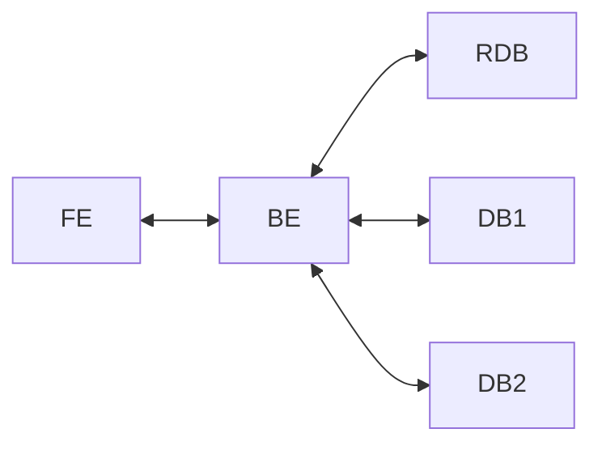

# Projeto: Polyglot Persistence

O objetivo deste projeto é estudar o armazenamento de dados em diversos bancos tendo o uso do dado pela aplicação como critério de escolha para o tipo de banco que será usado.

O tema do projeto é livre, porém a implementação **deve** seguir o seguinte modelo:

em que:
- RDB é um banco relacional;
- DB1 e DB2 são bancos que não podem ser relacionais (NoSQL) e não podem ser o mesmo banco;
- BE: é o backend que recebe requisições e usa os seviços de bancos de dados. O backend deve permitir fazer todas as operações de CRUD;
- FE: frontend que faz requisições e recebe respostas do backend.

## Exemplo de tema

Um marketplace em que:
- RDB: armazena dados dos clientes cadastrados;
- DB1: um banco do tipo document storage para armazenar os dados dos produtos;
- DB2: um wide-column storage para armazenar os dados de pedidos realizados;
- FE: deve gerar requisições sobre CRUD de clientes, CRUD de produtos e compra de produtos por clientes;
- BE: dividido em 3 serviços com um deles responsável pela parte do CRUD do cliente, um para o CRUD de produtos e o último para tratar os pedidos de compra

## Entrega

A entrega do projeto será por meio de um repositório de um sistema de versionamento (i.e., github, gitlab, bitbucket, etc) que deve conter:
- todo o código desenvolvido para o projeto
- README.md com:
    1. a explicação do tema escolhido;
    2. justificativa para cada banco usado no projeto e definição de como backend será implementado;
    3. explicação de como executar o projeto e quais serviços devem ser usados;
- todos os recursos necessários para executar o projeto considerando um ambiente sem nenhuma execução prévia do projeto;

## Desenvolvimento e avaliação do projeto

O projeto será dividido em 2 partes sendo:
    - A primeira parte tem o foco na proposta do projeto e será avaliada a partir da atividade que será realizada aproximadamente 1 mês após o início das aulas;
    - A segunda parte tem o foco na implementação e será avaliada pela combinação do código entregue no final do semestre e as apresentações realizadas nos últimos dias de aula;
